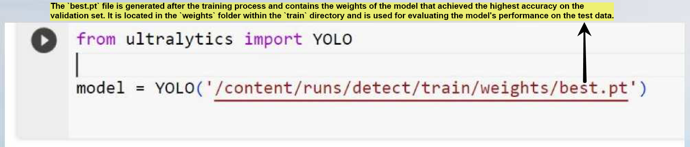

# Single-Category Object Detection 

## Table of Contents
1. [Introduction](#introduction)
2. [Dataset Structure](#dataset-structure)
3. [Model Configurations](#model-configurations)
4. [Ablation Study Results](#ablation-study-results)
5. [Precision Results](#precision-results)
6. [Conclusion](#conclusion)

## Introduction
This repository hosts our Single-Category Object Detection project, which explores various configurations of the YOLO V8 model, including Nano and S versions, to optimize detection performance for a single category.

## Data Processing: 

The data consists of video frames, with preprocessing involving normalization, resizing, and applying Gaussian blur. The data setup is organized into folders, each containing 30 videos of 2 seconds duration at 12 frames per second resulting in a total of 720 frames per folder.

## Model Training and Testing

The data is divided into 60% training, 20% validation, and 20% testing sets. The dataset is structured as follows:

dataset/
├── train/
│ ├── images/
│ └── labels/
├── val/
│ ├── images/
│ └── labels/
└── test/
├── images/
└── labels/

Training Process: Adjustments are made to the image and label formats to comply with YOLO requirements, followed by training over 100 epochs.

## Model Configurations
The project evaluates multiple YOLO V8 architectures:
- Baseline YOLO V8 Nano
- YOLO V8 Nano with additional layers
- YOLO V8 Nano with batch normalization and more repeats
- YOLO V8 Nano with an altered detect layer
- YOLO V8 S for comparative purposes

## Ablation Study Results
The following table shows the Precision-Recall curves obtained from each model configuration:

<table>
<tr>
<th>Configuration</th>
<th>Precision-Recall Curve</th>
</tr>
<tr>
<td>Baseline YOLO V8 Nano</td>
<td></td>
</tr>
<tr>
<td>Adding Layers</td>
<td></td>
</tr>
<tr>
<td>Batch Normalization</td>
<td></td>
</tr>
<tr>
<td>Modified Detect Layer</td>
<td></td>
</tr>
<tr>
<td>YOLO V8 S</td>
<td></td>
</tr>
</table>

## Prediction Results
The table below displays the prediction results obtained from each model configuration:

<table>
<tr>
<th>Configuration</th>
<th>Prediction Result</th>
</tr>
<tr>
<td>Baseline YOLO V8 Nano</td>
<td></td>
</tr>
<tr>
<td>Adding Layers</td>
<td></td>
</tr>
<tr>
<td>Batch Normalization</td>
<td></td>
</tr>
<tr>
<td>Modified Detect Layer</td>
<td></td>
</tr>
<tr>
<td>YOLO V8 S</td>
<td></td>
</tr>
</table>

## Conclusion
Modifications to the detect layer in the YOLO V8 Nano architecture demonstrated significant improvements in detection precision. Detailed analysis and code can be found in the [Single Category.ipynb](https://github.com/FrozenWanderer/Single-Category-Object-Detection/blob/main/Single%20Category.ipynb) notebook.

