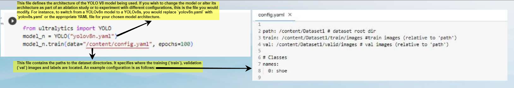
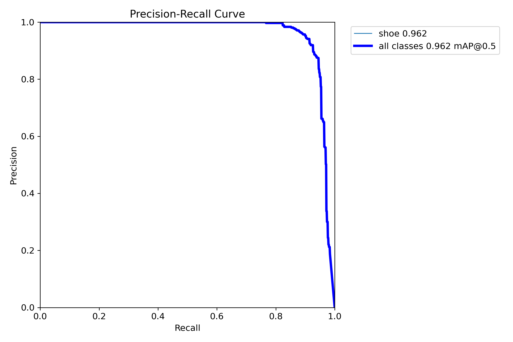
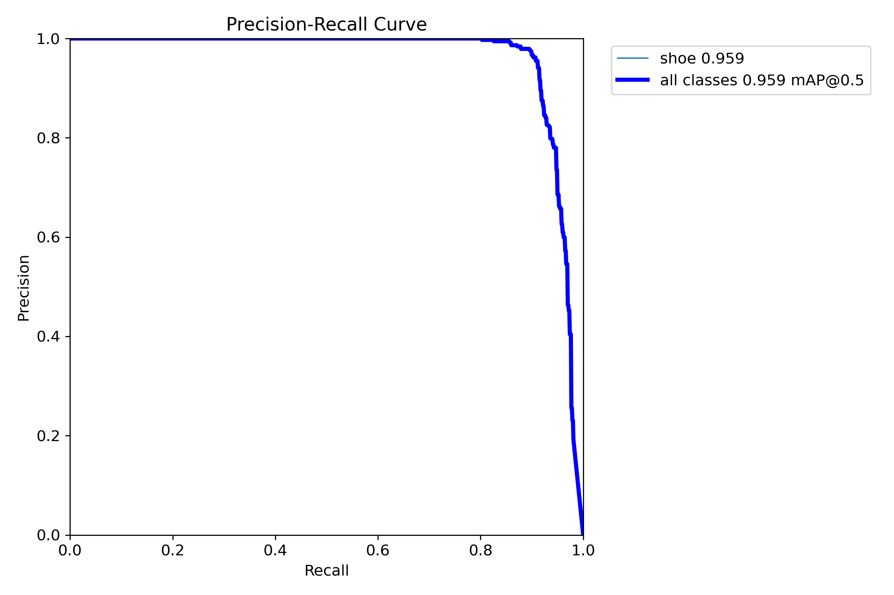
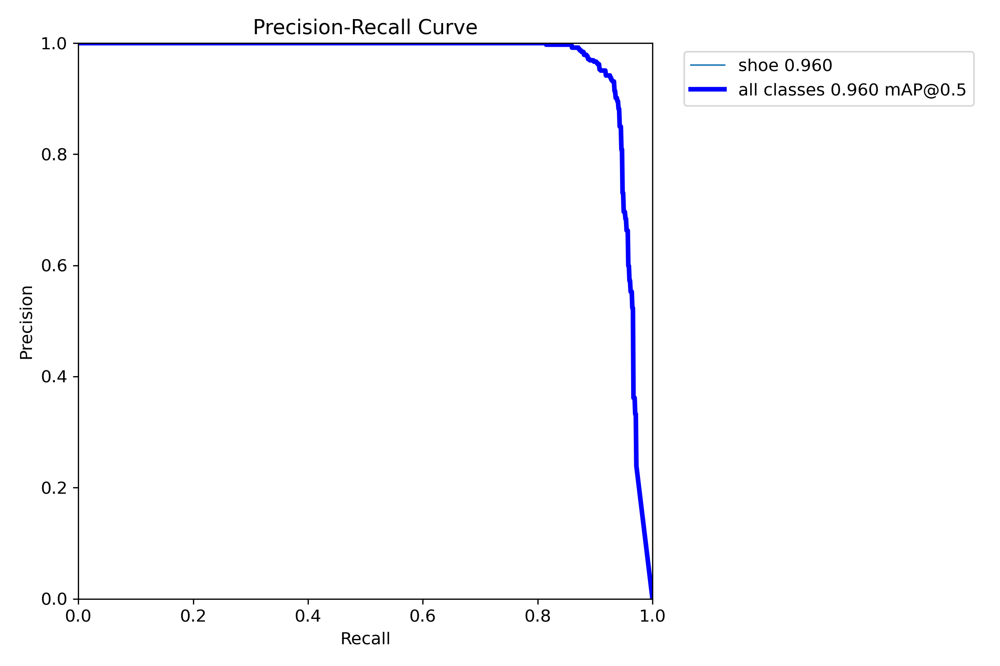
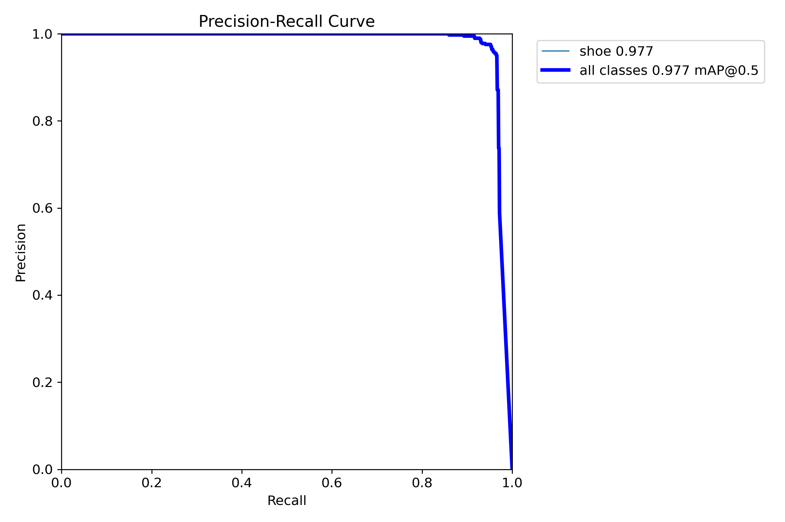
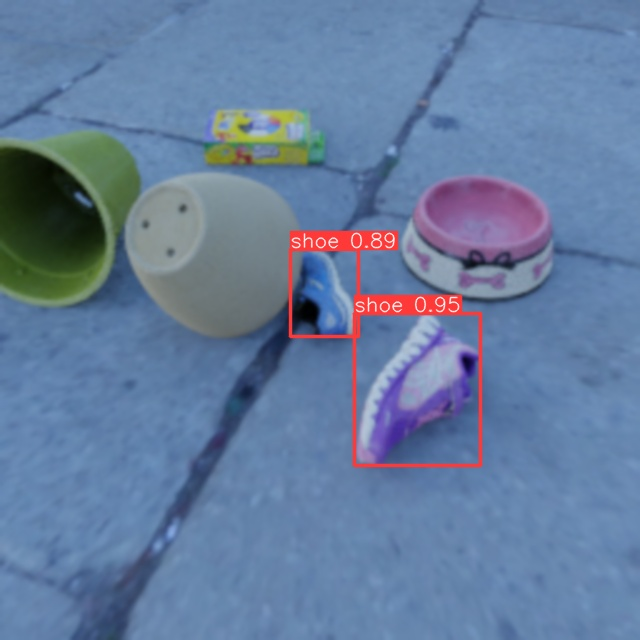

# Single-Category Object Detection 

## Table of Contents
- [Introduction](#introduction)
- [Data Processing](#data-processing)
- [Model Training and Testing](#model-training-and-testing)
- [Model Configurations](#model-configurations)
- [Ablation Study Results](#ablation-study-results)
- [Prediction Results](#prediction-results)
- [Conclusion](#conclusion)

## Introduction

This project aims to enhance Single-Category Object Detection by experimenting with various configurations of the YOLO V8 model. We focus on optimizing model performance, particularly on one category, to assess the trade-offs between accuracy and computational efficiency.

## Data Processing: 

The data consists of video frames, with preprocessing involving normalization, resizing, and applying Gaussian blur. The data setup is organized into folders, each containing 30 videos of 2 seconds duration at 12 frames per second resulting in a total of 720 frames per folder.

## Model Training and Testing

The data is divided into 60% training, 20% validation, and 20% testing sets. The directory structure is as follows:

```
dataset/   
├── train/  
│ ├── images/  
│ └── labels/
├── val/
│ ├── images/
│ └── labels/
├── test/
│ ├── images/
│ └── labels/

```

### Training Configuration

The training process involves configuring the model and dataset paths, as demonstrated in the image below. The `config.yaml` file specifies the dataset paths, and the `yolov8n.yaml` file defines the model's architecture. Adjustments to these files can be made to comply with YOLO requirements or to experiment with different model configurations during ablation studies.



Training is conducted over 100 epochs to ensure adequate model learning and performance optimization.

## Model Configurations
Our ablation study spans across multiple YOLO V8 configurations to pinpoint the optimal model structure:

- Baseline YOLO V8 Nano
- Enhanced YOLO V8 Nano with added layers
- YOLO V8 Nano with batch normalization and increased repeats
- YOLO V8 Nano with a modified detect layer
- Comparative analysis using YOLO V8 S

## Ablation Study Results

Each configuration's performance was evaluated using Precision-Recall curves. The visual comparison underscores the impact of each modification on the model's precision.

<table>
<tr>
<th>Configuration</th>
<th>Precision-Recall Curve</th>
</tr>
<tr>
<td>Baseline YOLO V8 Nano</td>
<td></td>
</tr>
<tr>
<td>Adding Layers</td>
<td></td>
</tr>
<tr>
<td>Batch Normalization</td>
<td></td>
</tr>
<tr>
<td>Modified Detect Layer</td>
<td></td>
</tr>
<tr>
<td>YOLO V8 S</td>
<td></td>
</tr>
</table>

The visual results of the models' prediction capabilities can be reviewed in the [`runs` folder](https://github.com/Moataz-Habib/Single-Category-Object-Detection/tree/main/runs), which contains comprehensive examples of each configuration's detection output.


## Prediction Results
To assess the practical applicability of the models, their prediction results were evaluated. The following are the outcomes showcasing the detection capabilities of each configuration:

<table>
<tr>
<th>Configuration</th>
<th>Prediction Result</th>
</tr>
<tr>
<td>Baseline YOLO V8 Nano</td>
<td></td>
</tr>
<tr>
<td>Adding Layers</td>
<td></td>
</tr>
<tr>
<td>Batch Normalization</td>
<td></td>
</tr>
<tr>
<td>Modified Detect Layer</td>
<td></td>
</tr>
<tr>
<td>YOLO V8 S</td>
<td></td>
</tr>
</table>


## Conclusion

The YOLO V8 S model emerges as the leading configuration from this study, demonstrating higher accuracy in object detection, which is critical for practical deployment. Its robust performance in precision suggests that even minor architectural modifications can have a significant impact on results.

The [Single Category Object Detection notebook](https://github.com/Moataz-Habib/Single-Category-Object-Detection/blob/main/Single%20Category%20Object%20Detection.ipynb) details the experimentation process and offers insights into the potential of YOLO V8 advancements, particularly for specialized detection tasks.


